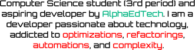

  

  
  
  
  

  <picture>
    <source media="(prefers-color-scheme: dark)" srcset="./assets/whoamiDark.svg">
    
  </picture>

   <null>

  <picture>
    <source media="(prefers-color-scheme: dark)" srcset="./assets/aboutDark.svg">
    
  </picture>

  <picture>
    <source media="(prefers-color-scheme: dark)" srcset="./assets/techstackDark.svg">
    
  </picture>

   <null>

  <picture>
    <source media="(prefers-color-scheme: dark)" srcset="./assets/languagesDark.svg">
    
  </picture>

   

  
  
  

  

   

  <picture>
    <source media="(prefers-color-scheme: dark)" srcset="./assets/aidatascienceDark.svg">
    
  </picture>

   

  
  
  
  
  
  

  

   

  <picture>
    <source media="(prefers-color-scheme: dark)" srcset="./assets/backendfrontendDark.svg">
    
  </picture>

   

  
  
  
  
  
  
  

  

   

  <picture>
    <source media="(prefers-color-scheme: dark)" srcset="./assets/databaseinfrastructureDark.svg">
    
  </picture>

   

  
  
  
  

  

   

  <picture>
    <source media="(prefers-color-scheme: dark)" srcset="./assets/toolsplatformsDark.svg">
    
  </picture>

   

  
  
  
  
  
  

  

   

  <picture>
    <source media="(prefers-color-scheme: dark)" srcset="./assets/currentlylearningDark.svg">
    
  </picture>

   

  
  
  
  
  
  
  

  <picture>
    <source media="(prefers-color-scheme: dark)" srcset="./assets/statisticsDark.svg">
    
  </picture>

   <null>

  
  
  

