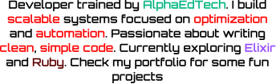

  

<!-- BADGES -->

 

  
  
  
  

 <!-- WHO AM I -->

  <picture>
    <source media="(prefers-color-scheme: dark)" srcset="./assets/whoamiDark.svg">
    
  </picture>

   <null>

  <picture>
    <source media="(prefers-color-scheme: dark)" srcset="./assets/aboutDark.svg">
    
  </picture>

<!-- TECH STACK -->

  <picture>
    <source media="(prefers-color-scheme: dark)" srcset="./assets/techstackDark.svg">
    
  </picture>

   <null>

  <!-- LANGUAGES -->
  <picture>
    <source media="(prefers-color-scheme: dark)" srcset="./assets/languagesDark.svg">
    
  </picture>

   

  
  
  
  
  

  

   

<!-- AI & DATAS CIENCE -->
  <picture>
    <source media="(prefers-color-scheme: dark)" srcset="./assets/aidatascienceDark.svg">
    
  </picture>

   

  
  
  

  

   

<!-- BACKEND & FRONTEND -->
  <picture>
    <source media="(prefers-color-scheme: dark)" srcset="./assets/backendfrontendDark.svg">
    
  </picture>

   

  
  
  
  
  

  

   

<!-- DATABASE & INFRASTRUCTURE -->
  <picture>
    <source media="(prefers-color-scheme: dark)" srcset="./assets/databaseinfrastructureDark.svg">
    
  </picture>

   

  
  
  

  

   

<!-- MONITORING -->
  <picture>
    <source media="(prefers-color-scheme: dark)" srcset="./assets/monitoringDark.svg">
    
  </picture>

   

  
  
  

  

   

<!-- TOOLS & PLATFORMS -->
  <picture>
    <source media="(prefers-color-scheme: dark)" srcset="./assets/toolsplatformsDark.svg">
    
  </picture>

 

  
  
  
  
  
  
  

  

   

  <picture>
    <source media="(prefers-color-scheme: dark)" srcset="./assets/currentlylearningDark.svg">
    
  </picture>

   
  
  
  

